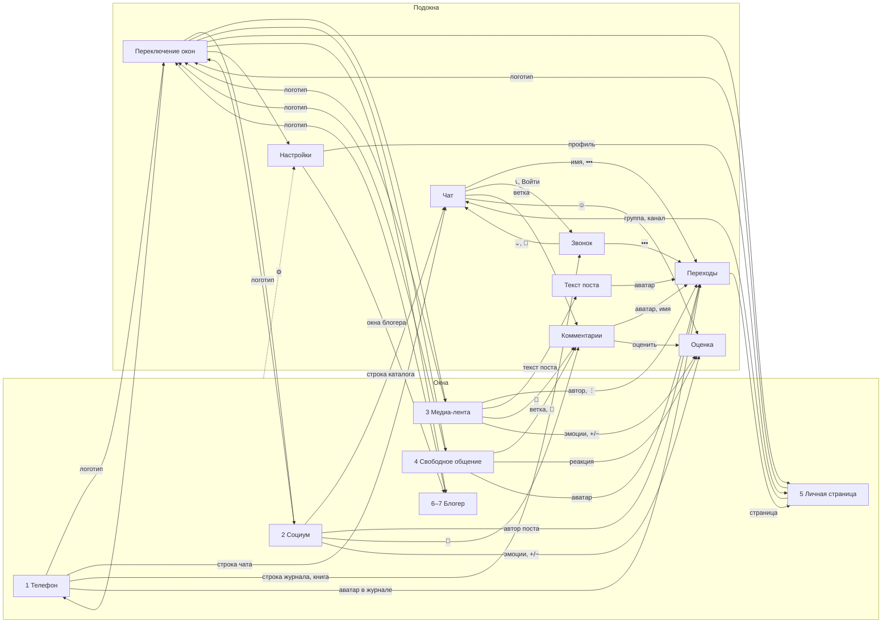

# Интерфейс по макету — функциональная документация

> **Источник:** макет [Layout-UI-light](Layout-UI-light/README.md) (тёмная тема
> [Layout-UI-dark](Layout-UI-dark/README.md) — те же экраны с другими значениями
> цвета; поведение не отличается и потому здесь не дублируется).
>
> **Что это:** реестр функционала, который предполагает интерфейс, — что
> пользователь может сделать и что приложение обязано уметь показывать. Это
> **не** описание текущего состояния кода: утверждение «экран показывает X»
> читается как «приложение обязано уметь дать X», а не «это уже реализовано».
>
> **Чего здесь нет:** оформления. Геометрия, палитра, контраст и пробы — в
> [Layout-UI-light/README.md](Layout-UI-light/README.md). Сюда попадает только
> то, что оформление *означает*: цвет и заливка в макете — это код состояний,
> и приложение обязано эти состояния различать.
>
> **Статус:** написан по макету и со временем заменяет 32 файла
> [doc_UI/](doc_UI/00-index.md). Соответствие — §13; что при замене пока
> потерялось бы — §12.

## §1. Оболочка

### Окна и подокна

Приложение — **семь окон**: пять базовых и два блогерских, которые включаются
в настройках и появляются в переключателе отдельной группой. Поверх окон
открываются **подокна**: чат, звонок, комментарии, текст поста, оценка,
переходы, переключение окон, настройки.

| № | Окно | Назначение | Вкладки | Счётчик в переключателе |
|---|------|-----------|---------|------------------------|
| 1 | Телефон | личная связь: чаты 1-на-1, книга, звонки | Чаты · Книга · Звонки | да |
| 2 | Социум | текстовая среда: ленты и каталог | Общая · Друзья · Каталог | да |
| 3 | Медиа-лента | фото и видео | Общая · Друзья · Каталог; режимы Лента / Слайды | нет |
| 4 | Свободное общение | где ответили, как оценили ваше, что собрали | Ответы · Реакции · Коллекции; сверху истории | да |
| 5 | Личная страница | профиль и своё хозяйство | Избранное · Коллекции · Мои группы | нет |
| 6 | Медиа-блогер | публикация и статистика (медиа-среда) | — | нет |
| 7 | Новостной блогер | то же для новостной среды | — | нет |

Правила оболочки, которые макет фиксирует как функционал:

- **Смена окна — только через логотип.** Логотип и название окна — одна область
  нажатия; она открывает подокно «Переключение окон». Нижней панели вкладок
  нет нигде.
- **Единая сессия.** Переключение окон не сбрасывает состояние: вкладка,
  прокрутка, выбранный чат остаются.
- **Сводные счётчики непрочитанного существуют ровно в одном месте** — в
  переключателе окон, янтарным числом у каждого окна. Внутри окон счётчики
  живут на своих объектах.
- **Плашка в шапке — признак основного окна.** У подокон шапка без плашки, и
  выход из подокна — «‹» назад, а не переключение окон.

### Зоны экрана

Экран собран из четырёх зон (термины макета):

1. **Зона 1 — панель:** логотип и имя окна (у подокна — «‹», аватар и имя
   собеседника), справа поиск и настройки.
2. **Зона 2 — содержимое:** список, лента, поток сообщений. Прокручивается.
3. **Зона 3 — плавающая гроздь:** круглые кнопки справа внизу поверх
   содержимого — «написать», «набрать номер», «стрелка вниз» со счётчиком
   новых.
4. **Зона 4 — строка ввода:** вложения, поле, голосовое, отправить.

### Язык состояний

Макет кодирует состояния цветом и заливкой; приложение обязано эти состояния
различать и поставлять:

| Признак в макете | Состояние |
|---|---|
| янтарное число | непрочитанное / активность, требующая ответа |
| янтарная точка у записи журнала | пропущенный звонок |
| зелёное | подтверждено: доставлено, прочитано, E2E, «видел» |
| зелёное число у раздела | сколько объектов в разделе |
| залитая кнопка против прозрачной | включено против выключено (микрофон, камера, динамик) |
| залитый чип против пустого | выбранный фильтр / выбранная эмоция / моя оценка |
| пунктирный пузырь в чате | вложенная голосовая комната |
| рамка у истории | непросмотренная |
| «E2E» / «открыто» | защищённость объекта |

## §2. Сквозные механики

То, что повторяется в нескольких окнах, описано здесь один раз.

### Разделы

Сквозная раскладка по темам — **один набор разделов на всё приложение**;
каждое окно наполняет его своими объектами (каноника —
[01-product/разделы.md](01-product/разделы.md), макет —
[телефон/разделы.html](Layout-UI-light/телефон/разделы.html)):

- Объект принадлежит **ровно одному** разделу; раздел назначается при
  добавлении и может быть изменён позже (перенос, не копия).
- Есть предопределённые разделы (меню для выбора) и пользовательские;
  показываются только те, что пользователь добавил, **включая пустые**.
- «Общий» — системный раздел-улавливатель: всегда последний, не удаляется и
  не переименовывается. «Всё» — не раздел, а снятый фильтр.
- Вложенности разделов в разделы нет.
- У раздела **две цифры**: зелёная — сколько объектов, янтарная — у скольких
  есть новые сообщения (считаются объекты, не сообщения). Обе — в рамках
  текущего окна и вкладки.
- **Четыре исполнения от двух независимых тумблеров** правее вкладок —
  «полоса» и «ярлычки»: гармошка (Б), плитка (А), полоса текстом (Г), полоса
  ярлычками (В). Это четыре вида одного экрана, не четыре экрана.
- Две модели навигации: в гармошке и плитке раздел **открывают** (табы
  заменяются на «← назад», имя раздела и обе цифры), в полосе раздел
  **фильтрует** список на месте, а возврат к полному списку — чип «Всё».
  Пока полоса выбрана, заголовков разделов в списке нет.
- В гармошке у строки раздела две цели: слева (значок, зелёная цифра, имя) —
  внутрь раздела; справа (янтарная цифра и шеврон) — свернуть/развернуть на
  месте. Тем же шевроном разворачивается сообщество внутри списка.
- «Добавить раздел» — в конце полного списка (гармошка, плитка) и в
  настройках; на полосе его нет.

### Оценка

Два независимых инструмента, которые макет нигде не смешивает:

1. **Шкала эмоций** — девять состояний по пяти осям (+1/−1; «Спокойствие»
   нейтрально): Одобрение/Презрение, Смех/Боль, Ярость/Страх,
   Интерес/Скука, Спокойствие. Одна эмоция на объект от человека; можно
   сменить; можно снять. Ставится на сообщение, комментарий, пост — из
   подокна «Оценка».
2. **«+ / −»** — решение о том, показывать ли такое в общей ленте. Не эмоция;
   только у публичного содержимого.

Снаружи шкала видна агрегатом: три частые эмоции с числами и «настроение» —
усреднённое по шкале от −1 до +1. Полный список эмоций с числами — в подокне
«Оценка», куда ведёт любая из них.

### Комментарии и ветки

- Одна раскладка — оверлей снизу — для комментариев к посту и для ветки в
  чате; у ветки первой строкой исходное сообщение, сводки эмоций нет.
- Вложенность ровно **два уровня**.
- Сводка эмоций относится к содержимому, не к комментариям.
- Под комментарием три действия: «Ответить» (подставляет `@имя` в поле),
  эмоция с числом, «поделиться».
- В слайдах комментарии — оверлей на нижнюю половину кадра; видео не
  прерывается.

### Окно переходов

Контекстное меню по человеку, каналу или посту. Открывается по имени или
аватару отовсюду (чат, ленты, слайды, комментарии, звонок). Одна шапка —
аватар, имя, вторая строка, «✕» — и три набора пунктов:

- **человек:** страница, закреплённые, поиск по чату, общие медиа,
  уведомления, блокировка;
- **канал:** страница канала, закреплённые, поиск, общие медиа, уведомления,
  статистика (если есть доступ), отписка;
- **пост в слайдах:** страница автора, поиск по автору, в коллекцию,
  поделиться, блокировка — плюс блок о самом посте (текст, теги, эмоции,
  дата).

Правила: условный пункт без данных не показывается (пусто — пункта нет);
опасное — последним; своей навигации нет, закрытие возвращает точно туда,
откуда открыли.

### Индикация шифрования

- **Окно 1 шифруется целиком** — метка «E2E» одна, в статусной строке окна;
  исключений внутри не бывает.
- **Окна 2–3 — метка на каждом объекте:** «E2E» или «открыто»; у коллекций —
  «E2E · личная» или «публичная».
- **Звонок** — «E2E · сигналинг»: шифруется установление связи, медиа идёт
  через сервер ([ADR-0006](adr/0006-livekit-media-policy.md)).

### Подписки, псевдонимы, виртуальные авторы

- «Подписаться» — действие; «Вы подписаны» — состояние, тихое. Место кнопки
  постоянно, теги обрезаются об неё.
- Публиковать можно от основного аккаунта и от **псевдонимов** (виртуальных
  пользователей); активный выбран в блоке «Публикую как» окон блогера.
- Реакции на записи виртуальных авторов приходят в окно 4 с именем автора.

### Медиа и текст поста

- Вложения переключаются **точками**; у видео точки живут в строке времени
  между «сколько проигралось» и «сколько всего».
- Текст поста: в ленте — три строки с кнопкой разворота, в слайдах — одна
  строка на кадре, нажимают сам текст. Раскрывается одинаково — подокном
  «Текст поста» листом снизу; кадр остаётся под листом, видео не
  прерывается.

## §3. Окно 1 — Телефон

Макет: [телефон/окна/телефон.html](Layout-UI-light/телефон/окна/телефон.html). Личная связь:
книга контактов, чаты один-на-один, звонки. Всё под сквозным шифрованием.

### Вкладка «Чаты»

Список личных чатов; ниже — раздел «Пропущенные звонки».

| Элемент | Что делает | Куда ведёт |
|---|---|---|
| логотип + «Телефон» | переключение окон | подокно «Переключение окон» |
| 🔍 | поиск по окну | подокно «Поиск» |
| ⚙ | настройки | подокно «Настройки» |
| строка чата | открыть переписку | подокно «Чат» |
| строка пропущенного | открыть звонок | подокно «Звонок» |
| ✎ (зона 3) | написать новое | подокно «Чат» |

Данные экрана: метка E2E; по каждому чату — аватар, имя, превью последней
реплики (текст, «📎 файл», «🎤 голосовое, 0:12»), время или дата словами
(«вчера»), счётчик непрочитанных, статус «в сети»; по пропущенному — число
попыток. Служебный чат «Заметки» — сообщения себе.

### Вкладка «Книга»

Контакты по разделам (гармошка, §2). Поиск по книге с кнопкой «добавить
контакт».

| Элемент | Что делает | Куда ведёт |
|---|---|---|
| строка контакта | открыть чат | подокно «Чат» |
| 📞 в строке | позвонить | подокно «Звонок» |
| 📹 в строке | видеозвонок | подокно «Звонок» |
| раздел слева | внутрь раздела | экран раздела |
| шеврон справа | свернуть/развернуть | — |

Данные экрана: разделы с числом контактов; статусы присутствия словами —
«в сети», «была 5 минут назад», «была вчера», «нет в сети».

### Вкладка «Звонки»

Журнал одной строкой. Фильтры: **Все · Контактов · Неизвестные ·
Пропущенные**; выбранный залит. «Неизвестные» — звонившие, которых нет в
книге; у них вместо имени номер.

| Элемент | Что делает | Куда ведёт |
|---|---|---|
| аватар | меню контакта из четырёх пунктов: позвонить, позвонить с видео, открыть чат, открыть страницу | модалка поверх журнала |
| вся строка правее аватара | голосовой звонок | подокно «Звонок» |
| ⌨ (зона 3) | набрать номер | экран набора (в макете не нарисован — §12) |

Отдельной кнопки «перезвонить» нет: звонит сама строка. Справа две величины —
время сверху, дата снизу без года: «Сегодня», «Вчера», дальше день и месяц.

Данные экрана: направление (↙ входящий / ↗ исходящий), тип (пропущенный,
групповой, видео), длительность словами, число попыток, признак «не в книге»,
число участников группового звонка.

## §4. Окно 2 — Социум

Макет: [телефон/окна/новости.html](Layout-UI-light/телефон/окна/новости.html). Текстовая
среда: общая лента, лента друзей, каталог. Шифрование не сплошное — метка на
каждом объекте.

### Вкладка «Общая»

Лента постов карточками на всю ширину.

| Элемент | Что делает | Куда ведёт |
|---|---|---|
| аватар / имя автора | окно переходов по автору | подокно «Переходы» |
| тег | срез по атрибуту | экран атрибута (не нарисован — §12) |
| эмоции с числами | полная разбивка | подокно «Оценка» |
| + / − | решение о показе в общей ленте | подокно «Оценка» |
| 💬 N · M веток | комментарии | подокно «Комментарии» |
| ↑ (зона 3) | к началу ленты | — |
| ✎ (зона 3) | новая публикация | редактор (не нарисован — §12) |

Данные экрана: по посту — автор, тип источника словами («канал», «публичная
группа»), время, метка шифрования, заголовок и текст, теги, агрегат эмоций с
числами, число комментариев и число веток, моё «+ / −».

### Вкладка «Каталог»

Группы, каналы и голосовые чаты по разделам — исполнение Б (гармошка, §2);
правее вкладок тумблеры «полоса» и «ярлычки».

| Элемент | Что делает | Куда ведёт |
|---|---|---|
| строка группы / канала | открыть | подокно «Чат» |
| строка голосового чата (вложена в группу, с отступом) | войти в комнату | подокно «Звонок» |
| строка сообщества | развернуть состав | вложенные группы и каналы |
| ＋ (зона 3) | создать объект | мастер создания (не нарисован — §12) |

Данные экрана: тип объекта словами, число участников или подписчиков, число
людей в голосовой комнате, состав сообщества («4 группы, 2 канала»), время
последней активности, счётчики непрочитанных, обе цифры раздела.

### Вкладка «Друзья»

В макете не нарисована; по концепции — лента из публичных полок избранного
друзей (§12).

## §5. Окно 3 — Медиа-лента

Макет: [телефон/окна/медиа.html](Layout-UI-light/телефон/окна/медиа.html). Фото и видео в двух
режимах — «Лента» и «Слайды»; режим — состояние окна в панели. Вкладки те же:
Общая · Друзья · Каталог.

Переключатель режимов стоит в шапке знаками: «▤» — лента, «▣» — слайды.
Подписями «Лента | Слайды» он вместе с логотипом, именем окна и кнопками поиска
и настроек не помещается в телефонные 380 точек. Подписи возвращаются там, где
место есть: в подокне «Поиск» кнопка «🔍» из шапки уходит и освобождает его, и
в колонке ПК.

### Режим «Лента»

| Элемент | Что делает | Куда ведёт |
|---|---|---|
| автор (вне кадра, строкой выше) | окно переходов | подокно «Переходы» |
| ⋮ в строке автора | другие действия | подокно «Переходы» |
| точки на кадре | переключение вложений | — |
| + / − на кадре | оценка для ленты | подокно «Оценка» |
| текст (3 строки) / ⌄ | полный текст | подокно «Текст поста» |
| «Подписаться» / «Вы подписаны» | подписка на автора | — |
| эмоции с числами | разбивка | подокно «Оценка» |
| 💬 | комментарии | подокно «Комментарии» |
| ＋ (зона 3) | новая публикация | редактор (не нарисован — §12) |

### Режим «Слайды»

Шапки нет вовсе: «←» и «⋮» в верхних углах кадра, автор с «Подписаться»
внизу, атрибутов нет. Точки и полоса прогресса — под кадром. Эмоции не
переносятся: что не поместилось, живёт в подокне «Оценка». Текст — одна
строка на кадре, нажатие открывает «Текст поста». Комментарии — оверлей на
нижнюю половину кадра.

### Вкладка «Каталог»

Коллекции по тем же разделам. Поиск по коллекциям с кнопкой «создать
коллекцию».

Данные экрана: по карточке — тип медиа (фото/видео), число вложений, текущее
и общее время видео, прогресс, теги, состояние подписки, агрегат эмоций с
отметкой «моя», число комментариев; по коллекции — число файлов, тип защиты
(«E2E · личная» / «публичная»), время обновления, непрочитанные.

## §6. Окно 4 — Свободное общение

Макет: [телефон/окна/общение.html](Layout-UI-light/телефон/окна/общение.html). Окно про
личное: где ответили, как оценили ваше, что собрали. Сверху — истории.

### Истории

Квадратные, рамка означает непросмотренное. Первая — «Своя» (добавить).

### Вкладка «Ответы»

Карточки: ветка, где ответили вам (ваша реплика цитатой, ответ, «2 новых в
ветке», «Открыть ветку»); отслеживаемое (текст, эмоции, число комментариев).
Раздел «Реакции на ваше»: сводка эмоций по вашим публикациям за период.

### Вкладка «Реакции»

Агрегатор: кто, что сделал и с чем — одной строкой. Фильтры: **Все ·
Комментарии · Оценки**. Типы реакций: комментарий к вашему посту (цитата,
«Открыть», «Ответить»), эмоция на ваше сообщение («Перейти к сообщению»),
«плюс» от канала, оценки записи виртуального автора («Посмотреть оценки»).

### Вкладка «Коллекции»

Плитки два в ряд: превью, число и тип медиа, метка «E2E · личная» /
«публичная». ＋ — создать коллекцию.

Данные экрана: число новых в ветке, агрегаты эмоций по своим публикациям за
период, тип и источник реакции, состав коллекций.

## §7. Окно 5 — Личная страница

Макет: [телефон/окна/страница.html](Layout-UI-light/телефон/окна/страница.html). Профиль и
своё хозяйство. То же окно на чужом профиле — без правки и ролей, вместо них
«Подписаться» и «↗».

Шапка: аватар, имя, `@имя`, номер телефона, описание, три числа — подписки,
подписчики, свои группы. Кнопки «Редактировать» и «↗».

| Вкладка | Содержимое |
|---|---|
| Избранное | закладки из окон 2 и 3 с пометкой источника; ниже блок «Свои группы и каналы» с ролями |
| Коллекции | та же плитка, что в окне 4 |
| Мои группы | свои группы и каналы с ролью: админ / модератор / участник |

| Элемент | Куда ведёт |
|---|---|
| закладка | назад в ту ленту, откуда пришла |
| строка группы / канала | подокно «Чат» |

Данные экрана: идентификаторы профиля, счётчики подписок и подписчиков,
источник и время закладки, тип и размер своих объектов, роль в каждом.

## §8. Окна 6–7 — Блогер

Макет: [телефон/окна/блогер.html](Layout-UI-light/телефон/окна/блогер.html). Включаются в
настройках одним пунктом; появляются в переключателе отдельной группой с
указанием псевдонима. Раскладка одна; у новостного блогера другие метрики
(прочтения, ветки, цитирования).

- **«Публикую как»**: активный аккаунт, кнопка «Сменить», чипы псевдонимов,
  «＋ псевдоним».
- **Статистика за 7 дней**, четыре плитки: просмотры и охват с динамикой в
  процентах; реакции с разбивкой по эмоциям; «настроение» — усреднённое по
  шкале от −1 до +1.
- **Меню**: разбор по постам; роли и права в чатах; рекламный кабинет (число
  кампаний); оформление чатов.

Данные экрана: список псевдонимов, период и метрики статистики с динамикой,
распределение эмоций, индекс настроения, число рекламных кампаний.

## §9. Подокна

Общее правило: у подокна нет своей навигации. Оно открывается поверх окна и
закрывается ровно туда, откуда пришло; шапка без плашки, выход — «‹» или
«✕», касание вне, «Esc» на десктопе.

### Чат

Макет: [телефон/подокна/чат.html](Layout-UI-light/телефон/подокна/чат.html). Два состояния:
личный чат (E2E, статус «печатает…») и групповой (авторы, упоминание, ветка,
вложенная голосовая комната).

| Элемент | Что делает | Куда ведёт |
|---|---|---|
| ‹ | назад | окно-источник (1 или 2) |
| аватар / имя в шапке | окно переходов | подокно «Переходы» |
| 📞 в шапке | звонок | подокно «Звонок» |
| ••• | меню чата | подокно «Переходы» |
| ☺ у чужого сообщения | шкала эмоций; долгое нажатие — ответ | подокно «Оценка» |
| нажатие на сообщение | ответ | цитата в поле ввода |
| ↓ у вложения | скачать файл | — |
| «ветка · N ответов» | ветка | подокно «Комментарии» |
| «Войти» у комнаты | голосовая комната | подокно «Звонок» |
| ↓ с биркой новых (зона 3) | к новым сообщениям | — |
| ⊕ | вложения | — |
| 🎙 | голосовое сообщение | — |
| ➤ | отправить | — |

Признаки сообщений, которые приложение обязано различать:

- **галки:** отправлено / доставлено / прочитано; часики — в очереди;
- **точка «я это видел»** у чужих сообщений — серая / зелёная;
- **серия:** у продолжений от того же автора нет ни аватара, ни имени; полоса
  автора идёт до конца серии; цвет полосы присваивается автору при входе в
  чат;
- **цитата** — вертикальная черта с текстом исходного;
- **@упоминание** в группе; подсказка в поле ввода;
- **эмоции на сообщении** — метки с числами внутри пузыря; у своих сообщений
  кнопки нет, метки остаются;
- **системные события:** «Сегодня», «включила исчезающие сообщения · 7 дней»,
  «добавил участника»;
- **вложение-файл:** имя, размер, скачивание;
- **вложенная голосовая комната:** название, сколько в комнате, сколько идёт,
  «Войти».

### Звонок

Макет: [телефон/подокна/звонок.html](Layout-UI-light/телефон/подокна/звонок.html). Три
состояния: входящий, разговор, видео. Вытесняет окно целиком, но
сворачивается в полоску — переписку можно продолжать во время разговора.

| Элемент | Что делает |
|---|---|
| Принять | входящий → разговор |
| Отклонить | входящий → назад |
| Ответить сообщением | входящий → чат |
| ⌄ | свернуть в полоску, вернуться в чат |
| 💬 | чат, не разрывая звонок |
| 🎤 / 🔊 / 📹 | включить-выключить; включённое залито |
| 🔄 | переключить камеру (видео) |
| Завершить | назад, откуда пришли |

Данные: имя и аватар собеседника, тип и статус («Входящий аудиозвонок»,
«Разговор идёт»), длительность, состояния микрофона, динамика, камеры, «E2E ·
сигналинг». Открывается из чата, из книги, из журнала, из голосовой комнаты;
входящий — поверх любого окна без спроса.

### Комментарии

Макет: [телефон/подокна/комментарии.html](Layout-UI-light/телефон/подокна/комментарии.html).
Оверлей снизу; содержимое остаётся сверху. Заголовок — число комментариев и
веток. Сводка эмоций по содержимому с кнопкой «оценить». Два уровня
вложенности. Под комментарием: «Ответить», эмоция с числом, «↗». Поле ввода
«Написать комментарий…» с отправкой. Открывается из «💬» под постом, из ветки
в чате, из окна 4, из слайдов.

### Текст поста

Макет: [телефон/подокна/текст-поста.html](Layout-UI-light/телефон/подокна/текст-поста.html).
Лист снизу по шаблону комментариев: шапка с автором и «✕», серая сводка
(записи, подписчики — отвечает на «подписываться ли»), текст с прокруткой
внутри листа, шапка на месте. Кадр под листом продолжает играть. Кнопки
«Подписаться» в листе нет — она на своём месте внизу слайда.

### Оценка

Макет: [телефон/подокна/оценка.html](Layout-UI-light/телефон/подокна/оценка.html). Шкала
эмоций (§2): оси строками, знаки столбцами; одна эмоция, смена, «Снять».
Отдельно — «+ / −» для общей ленты. Снаружи видны три частые эмоции и
«настроение». Открывается из чата, лент, слайдов, комментариев, окна 4.

### Переходы

Макет: [телефон/подокна/переходы.html](Layout-UI-light/телефон/подокна/переходы.html). Три
набора пунктов — человек, канал, пост — и правила условных пунктов (§2).

### Переключение окон

Макет:
[телефон/подокна/переключение-окон.html](Layout-UI-light/телефон/подокна/переключение-окон.html).
Единственный способ сменить окно. Шапка — логотип, «Окна», текущий
пользователь. У каждого окна вторая строка-описание и янтарный счётчик
непрочитанного — единственное место со сводными счётчиками. Блогерские окна —
отдельной группой «включено в настройках», с псевдонимом публикации.
Настройки — последним пунктом.

### Настройки, помощь, баги

Макет: [телефон/подокна/настройки.html](Layout-UI-light/телефон/подокна/настройки.html).
Открывается по «⚙» из любого окна. Пункты с текущими значениями справа:
профиль (→ окно 5); секретная фраза и устройства (число устройств; внутри —
удаление аккаунта и выход); уведомления (3 уровня); оформление; язык;
приватность и блокировки; память и трафик; окна блогера (чип «включено»);
частые вопросы; сообщить о проблеме; о приложении (версия).

Форма проблемы: поле «Что случилось», ярлыки категорий («Не приходят
сообщения», «Звонок», «Вид», «Другое»), приложенное — версия, ОС, id
устройства, 40 строк журнала — с явным пояснением, что переписка и медиа не
отправляются.

### Поиск

Макет: [телефон/подокна/поиск.html](Layout-UI-light/телефон/подокна/поиск.html).
Открывается по «🔍» из любого окна и не уводит с него: под вкладками
разворачивается полоса поиска, само окно остаётся. Кнопка «🔍» на это время из
шапки уходит; в окне 3 освободившееся место возвращает переключателю режимов
подписи «Лента | Слайды» вместо знаков. Уход — «✕» в полосе.

Ищет по текущему окну, а не по всему сразу: в окне 1 — чаты и книга, в окне 2 —
посты и каналы, в окне 3 — лента и коллекции. Пустое поле показывает недавнее,
тех, кого искали, и теги окна. С введённым словом сперва идут чипы с числами по
видам находок — это фильтр, а не вкладки, — потом сами находки группами;
совпадение выделено в строке.

Полоса поиска во вкладке «Каталог» окон 2 и 3 — то же поле, только постоянное.

## §10. Карта переходов

Собрана из ссылок макета. Пунктир — подокна, которые возвращают в источник.

## §11. Что обязан уметь бэкенд

Сводка данных из §3–§9. Это требования, которые следуют из интерфейса; что из
этого уже есть — вопрос к коду, а не к этому документу.

**Сущности:** человек (профиль с `@имя`, номером, описанием), контакт,
личный чат, личная и публичная группа, канал, сообщество (состав: группы и
каналы), голосовой чат (вложен в группу), пост (текстовый и медиа), вложения
поста, коллекция (личная шифрованная / публичная), история, закладка,
псевдоним (виртуальный пользователь), раздел.

**Счётчики и агрегаты:**

- непрочитанные: по чату, по объекту каталога, по разделу (объектов с новым),
  сводно по окну;
- по разделу: сколько объектов;
- по посту: эмоции по видам с числами, «настроение» (−1…+1), комментарии и
  ветки раздельно, моё «+ / −» и моя эмоция;
- по комментарию: эмоции с числами;
- по звонку: направление, тип, длительность, число попыток, участники;
- по голосовой комнате: сколько людей, сколько идёт;
- по профилю: подписки, подписчики, свои группы;
- по коллекции: число файлов, тип защиты, непрочитанные;
- по автору: записи, подписчики (сводка в «Тексте поста»);
- статистика блогера за период: просмотры, охват, реакции с разбивкой по
  эмоциям, настроение, динамика в процентах, рекламные кампании.

**Состояния:** присутствие словами («в сети», «была N минут назад», «нет в
сети»); «печатает…»; доставка и прочтение сообщений; «я это видел»; серия от
одного автора; исчезающие сообщения с сроком; подписка («Подписаться» / «Вы
подписаны»); роль в своей группе (админ / модератор / участник); доступ к
статистике канала; режим уведомлений объекта; включённость окон блогера;
включённое/выключенное в звонке; непросмотренная история; «не в книге» для
звонившего.

**События для окна 4:** ответ в ветке (с числом новых), отслеживаемое
обсуждение, комментарий к моему посту, эмоция на моё сообщение, «плюс» от
канала, оценки записи виртуального автора — каждое с источником и временем.

## §12. Чего в макете нет

Макет покрывает не всё, что описано в [doc_UI/](doc_UI/00-index.md) и
[01-product/concept.md](01-product/concept.md). Эти темы остаются без
нарисованного интерфейса; при замене `doc_UI` их тексты придётся переносить
осознанно:

- **регистрация и вход** (телефон + SMS + email, резервные коды, временный
  режим), **восстановление**, **привязка устройства по QR**;
- **QR и инвайт-ссылки** (срок, лимит, роль новичка);
- **редактор контента** (пост, статья, медиа-пост, история; черновики,
  отложенная публикация) — в макете только кнопки «✎» и «＋»;
- **мастер создания** группы / канала / аудио-чата / сообщества;
- **страница сообщества** и админ-режим — в макете сообщество только строкой
  в каталоге;
- **глобальный поиск по всему сразу** — поиск по текущему окну нарисован
  (§9 «Поиск»), общего по всем окнам нет: он смешал бы вещи с разными правилами
  доступа;
- **экран набора номера** — есть кнопка «⌨»;
- **пересылка и репост** — в макете только «↗» и «Поделиться» без экрана
  выбора;
- **уведомления** глубже пункта настроек и режима в окне переходов (три
  уровня, тихие часы, группировка);
- **атрибуты и жанры** как экраны — теги показаны на постах, карточки
  атрибута нет;
- **вкладка «Друзья»** в окнах 2 и 3 — названа, не нарисована;
- **плеер** детально (перемотка, скорость, субтитры), **загрузка медиа**
  (качество, очередь), **архив**, **блокировка приложения**, **экспорт**;
- **входящие и «Мои треды»** окна 4 в полном виде агрегатора (managed inbox
  виртуальных пользователей, настройка правил агрегации);
- **адаптация** под планшет и десктоп.

## §13. Соответствие doc_UI

| Файл doc_UI | Куда ушло |
|---|---|
| 01-app-shell | §1 |
| 02-phone-home | §3 |
| 03-personal-chat | §9 «Чат» |
| 04-news-window | §4 |
| 05-group-chat | §9 «Чат» (групповой) |
| 06-channel | §4, §9 «Переходы» |
| 07-voice-chat | §4 (вложенная комната), §9 «Звонок»; отдельного экрана нет — §12 |
| 08-media-window | §5 |
| 09-media-slides | §5 |
| 10-social-interaction | §6; правила агрегации и managed inbox — §12 |
| 11-stories | §6 «Истории» |
| 12-activity-reactions | §6, §9 «Оценка» |
| 13-collections | §6, §7 |
| 14-personal-page | §7 |
| 15-comments | §9 «Комментарии» |
| 16-profile-popup | §9 «Переходы» |
| 17-global-search | §12 |
| 18-content-actions | §2 «Оценка» |
| 19-attachments-media | §9 «Чат» (вложения); плеер и загрузка — §12 |
| 20-share-repost | §12 |
| 21-call | §9 «Звонок» |
| 22-auth-registration | §12 |
| 23-auth-recovery | §12 |
| 24-device-linking | §12 |
| 25-settings-help-bugs | §9 «Настройки» |
| 26-notifications | §12 |
| 27-security-privacy | §2 «Индикация шифрования»; блокировки — §12 |
| 28-qr-invites | §12 |
| 29-blogger-media-window | §8 |
| 30-blogger-news-window | §8 |
| 31-adaptive-layout | §12 |
| 32-community | §12 |
| 33-create-group-channel | §12 |
| 34-content-editor | §12 |
| 35-attributes-genres | §12 |

## §14. Открытые вопросы

То, что сам макет называет нерешённым или где источники расходятся:

- нужна ли третья величина в сводке автора подокна «Текст поста» (например,
  дата регистрации);
- высота листа при коротком тексте (пробы в
  [пробы/пробы-текст.html](Layout-UI-light/пробы/пробы-текст.html));
- предел числа пользовательских разделов — не решён;
- точные имена и значки предопределённых разделов — не решены, в макете
  стоят заполнители;
- синхронизация разделов между устройствами — не специфицирована;
- поведение «Всё» как экрана в плиточном исполнении (А) — не до конца
  определено;
- в [телефон/разделы.html](Layout-UI-light/телефон/разделы.html) блок «Ведёт в» обещает
  переход внутрь раздела по чипу, тогда как полоса (исполнения В и Г)
  фильтрует список на месте; авторитетны
  [01-product/разделы.md](01-product/разделы.md) и
  [пробы/пробы-разделы-3.html](Layout-UI-light/пробы/пробы-разделы-3.html);
- сохранение состояния тумблеров «полоса» / «ярлычки» между сессиями — не
  оговорено.

