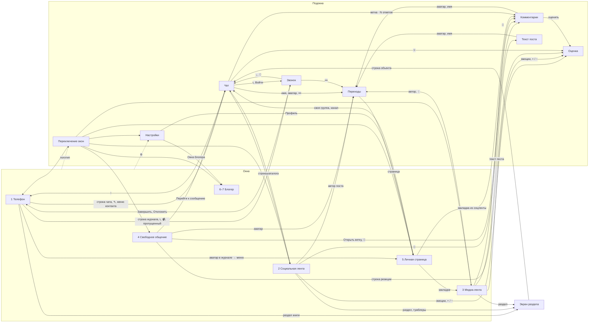

# Интерфейс по макету — функциональная спецификация

> **Источник — только** [Layout-UI-light](Layout-UI-light/README.md): шесть файлов
> `телефон/окна/*.html`, восемь `телефон/подокна/*.html`,
> [телефон/разделы.html](Layout-UI-light/телефон/разделы.html)
> и [индекс.html](Layout-UI-light/индекс.html). Тёмная тема
> [Layout-UI-dark](Layout-UI-dark/README.md) — те же экраны с другими значениями
> цвета; поведение в ней не отличается и потому здесь не описано. Широкие
> форматы — [планшет](Layout-UI-light/индекс-планшет.html) и
> [ПК](Layout-UI-light/индекс-пк.html) — прототип раскладки: полос больше,
> поведение то же, и отдельной спецификации у них нет.
>
> **Функционал, а не состояние кода.** Каждое утверждение читается как «интерфейс
> предполагает, что приложение умеет X». О том, что из этого уже написано в коде,
> документ не говорит ничего.
>
> **Поведение, а не оформление.** Геометрия, палитра, контраст и выбор начертаний
> остаются в [Layout-UI-light/README.md](Layout-UI-light/README.md). Сюда попадает
> только то, что оформление **означает**: янтарь — непрочитанное, зелёное —
> подтверждено, заливка кнопки — включённое состояние. Это не украшение, а
> перечень состояний, которые приложение обязано различать и поставлять.
>
> **Назначение.** Постоянная спецификация UI. Со временем заменяет
> [doc_UI/](doc_UI/00-index.md): соответствие файлов — §13, непокрытое макетом —
> §12.

---

## §1. Оболочка

### Окна и подокна

Приложение — **семь окон**: пять базовых и два блогерских, которые включаются в
настройках. Поверх любого окна открываются **подокна**: чат, звонок,
комментарии, текст поста, оценка, переходы, переключение окон, настройки,
поиск.

| № | Окно | Назначение | Вкладки | Счётчик в переключателе |
|---|------|-----------|---------|------------------------|
| 1 | Телефон | личная связь: чаты один-на-один, книга, звонки | Чаты · Книга · Звонки | да |
| 2 | Социальная лента | текстовая среда: ленты и каталог групп, каналов, сообществ | Общая · Друзья · Каталог | да |
| 3 | Медиа-лента | фото и видео | Общая · Друзья · Каталог; режимы «▤» лента / «▣» слайды | нет |
| 4 | Свободное общение | что касается лично вас: где ответили, как оценили, что собрали | Ответы · Реакции · Коллекции; сверху истории | да |
| 5 | Личная страница | профиль и своё хозяйство | Избранное · Коллекции · Мои группы | нет |
| 6 | Медиа-блогер | публикация от псевдонима и статистика по медиа-среде | — | нет |
| 7 | Новостной блогер | то же по текстовой среде | — | нет |

Имя окна в переключателе длиннее имени в его собственной панели: «Социальная
лента» против «Социум», «Свободное общение» против «Общение», «Личная страница»
против «Страница». Приложение обязано знать оба (см. §14).

Правила оболочки, которые макет фиксирует как функционал:

- **Смена окна — только через логотип.** Логотип и название окна — одна область
  нажатия от левого края шапки до кнопок; она открывает подокно «Переключение
  окон». Нижней панели вкладок нет нигде.
- **Сводные счётчики непрочитанного существуют ровно в одном месте** — в
  переключателе окон. Больше их собрать негде, потому что панели вкладок нет.
  Внутри окон счётчики живут на своих объектах и разделах.
- **Единая сессия.** Подокно возвращает ровно туда, откуда открылось; окно
  сохраняет вкладку, прокрутку и выбранное состояние.
- **Плашка в шапке — признак основного окна.** У подокна шапки-плашки нет, и
  выход из него — «‹» или «✕», а не переключение окон.
- **Поиск есть не везде.** Кнопка «🔍» стоит в окнах 1 и 2, во вкладке «Реакции»
  окна 4 и в панели окна под подокнами «Комментарии» и «Текст поста». В окнах 3,
  5 и 6–7 её нет. Отдельно существует поиск по списку — строкой внутри
  содержимого («Поиск по книге…», «Поиск по коллекциям…»).

### Четыре зоны экрана

Термины взяты из [телефон/подокна/чат.html](Layout-UI-light/телефон/подокна/чат.html), где
присутствуют все четыре:

1. **Зона 1 — панель.** Логотип и имя окна; у подокна вместо логотипа «‹», а
   рядом аватар и имя собеседника со статусом. Справа — поиск и настройки, у
   чата — звонок и «•••».
2. **Зона 2 — содержимое.** Список, лента, поток сообщений. Прокручивается.
   Между зоной 1 и зоной 2 живут вкладки, а под ними — режимы, фильтры или
   полоса разделов, если они в этом окне есть.
3. **Зона 3 — плавающая гроздь.** Круглые кнопки справа внизу поверх
   содержимого: «написать», «создать», «набрать номер», «↑» к началу, «↓» со
   счётчиком новых.
4. **Зона 4 — строка ввода.** Вложения, поле, голосовое, отправить. В
   комментариях она урезана до поля и «отправить».

### Язык состояний

Приложение обязано различать и поставлять состояния, которые макет кодирует
цветом, заливкой и рамкой:

| Признак в макете | Состояние |
|---|---|
| янтарное число | непрочитанное: сообщений в объекте, объектов в разделе, всего в окне |
| янтарная точка у записи журнала | пропущенный звонок |
| зелёное | подтверждено: доставлено, прочитано, E2E, «я это видел» |
| зелёное число у раздела | сколько объектов в разделе |
| залитая кнопка против прозрачной | включено против выключено (микрофон, динамик, камера) |
| залитый чип против контурного | выбранный фильтр, выбранная вкладка, моя эмоция, мой «+ / −» |
| подчёркнутый, но не залитый чип | выбранный раздел на полосе |
| общая рамка вокруг группы эмоций | «что уже поставили» — одно целое, а не набор |
| пунктирный пузырь в потоке чата | вложенная голосовая комната |
| рамка у истории | непросмотренная |
| «E2E» / «открыто» / «закрытая» / «публичная» | защищённость объекта |
| зелёный и красный у величины статистики | рост и падение — единственное место, где цвет значит «хорошо / плохо» |

---

## §2. Сквозные механики

То, что повторяется в нескольких окнах. Ниже, в §3–§9, эти механики только
называются.

### Разделы

Сквозная раскладка по темам: **один набор разделов на всё приложение**, каждое
окно наполняет его своими объектами — контактами в окне 1, группами и каналами в
окне 2, коллекциями в окне 3. Каноника понятия —
[01-product/разделы.md](01-product/разделы.md), макет —
[телефон/разделы.html](Layout-UI-light/телефон/разделы.html).

- Объект принадлежит **ровно одному** разделу.
- Показываются те разделы, что человек добавил, **включая пустые** (в макете
  «Спорт» с нулём объектов).
- «Общий» — системный улавливатель, всегда последний в списке.
- «Всё» — не раздел, а снятый фильтр: первый ярлык в плитке, первый чип на
  полосе.
- Вложенности разделов в разделы нет. Разворачивается внутри списка не раздел, а
  **сообщество** — тем же круглым шевроном.
- **Две цифры у раздела:** зелёная — сколько в нём объектов, янтарная — у
  скольких из них есть новое. Считаются объекты, не сообщения. У объекта цифра
  одна, янтарная: сколько в нём новых сообщений.
- **Четыре исполнения от двух независимых тумблеров** правее вкладок — «полоса»
  и «ярлычки»:

| | ярлычки отжаты | ярлычки нажаты |
|---|---|---|
| **полоса отжата** | Б · гармошка | А · плитка ярлычков |
| **полоса нажата** | Г · полоса текстом | В · полоса ярлычками |

- **Две модели навигации.** В А и Б раздел **открывают**: вкладки заменяются на
  «←», имя раздела и обе его цифры; это отдельный экран, один на все исполнения.
  В В и Г раздел **фильтрует список на месте**: вкладки остаются, возврат — чип
  «Всё».
- **Пока полоса нажата, заголовков разделов в списке нет.**
- **В гармошке у строки раздела две цели:** слева (значок, зелёная цифра, имя) —
  внутрь раздела; справа (янтарная цифра и шеврон) — свернуть и развернуть на
  месте.
- На полосе зелёной цифры нет — там переключают, и важно «где ждут», а не
  «сколько всего».
- Полоса тянется движением пальца или мыши; полосы прокрутки и стрелок у неё
  нет.
- **«Добавить раздел»** есть в А и Б последним пунктом и в настройках; на полосе
  его нет.

### Оценка

Два независимых инструмента, которые макет нигде не смешивает.

**1. Шкала эмоций** — девять состояний по пяти осям, положительное и
отрицательное:

| Ось | +1 | −1 |
|---|---|---|
| Статус | 👍 Одобрение | 🙄 Презрение |
| Разрядка | 😂 Смех | 😖 Боль |
| Угроза | 👊 Ярость | 😨 Страх |
| Внимание | 🔍 Интерес | 😑 Скука |
| Покой | 🧘 Спокойствие | нейтрально |

От человека на объект — **одна** эмоция; её можно сменить и можно снять
(«Снять»). Ставится на сообщение, комментарий и пост.

**2. «+ / −»** — решение о том, показывать ли такое в общей ленте. Не чувство, а
голос; стоит отдельно от эмоций и правее. Только у публичного содержимого.

Снаружи шкала видна **агрегатом**: три-пять самых частых эмоций с числами и
«настроение» — усреднение шкалы одним числом от −1 до +1. Полная разбивка — в
подокне «Оценка», куда ведёт любая эмоция.

Где эмоций ещё нет, вместо агрегата стоит один значок без числа.

### Комментарии и ветки

- Одна раскладка — лист снизу — и для комментариев к посту, и для ветки в чате.
  Разница в первой строке: у поста это сводка эмоций **по содержимому**, у ветки
  — исходное сообщение целиком.
- Вложенность ровно **два уровня**.
- Под комментарием: «Ответить», своя эмоция с числом, «↗». У ответа второго
  уровня «↗» нет.
- «Ответить» подставляет `@имя` в поле ввода.
- Панель окна остаётся видна над листом: человек не ушёл из ленты, а раскрыл её
  часть.
- В слайдах лист закрывает нижнюю половину кадра; видео не прерывается.

### Окно переходов

Контекстное меню по человеку, каналу или посту — самый частый элемент
приложения. Открывается по имени или аватару отовсюду. Одна шапка (аватар, имя,
вторая строка, «✕») и три набора пунктов:

- **человек:** страница, закреплённые, поиск по чату, общие медиа, уведомления,
  заблокировать;
- **канал:** страница канала, закреплённые, поиск по каналу, общие медиа,
  уведомления, статистика (если есть доступ), отписаться;
- **пост:** страница автора, поиск по автору, блок о самом посте (текст, теги,
  эмоции, дата), добавить в коллекцию, поделиться, заблокировать.

Правила: **условный пункт без данных не показывается**, а с данными показывает
их числом или словом справа («Закреплённые 3», «Общие медиа 48», «Уведомления ·
звук»); опасное — последним; своей навигации нет.

### Индикация шифрования

- **Окно 1 шифруется целиком:** метка «E2E» стоит один раз в статусной строке
  окна, исключений внутри не бывает.
- **Окна 2–3 — метка на объекте:** «E2E» или «открыто» чипом на посте.
- **Коллекции** — «E2E · личная» или «публичная» чипом на плитке; в каталоге
  окна 3 то же сказано словом в подписи («закрытая»).
- **Звонок — «E2E · сигналинг»:** шифруется установление связи, медиа идёт через
  сервер ([ADR-0006](adr/0006-livekit-media-policy.md)). Обещать сквозное там,
  где его нет, интерфейс не должен.

### Подписки, псевдонимы, виртуальные авторы

- «Подписаться» — действие, «Вы подписаны» — состояние. Место кнопки постоянно,
  теги обрезаются об неё: сколько тегов навесил автор, не должно двигать кнопку.
- Публиковать можно от основного аккаунта и от **псевдонимов** (виртуальных
  авторов); активный выбран в блоке «Публикую как» окон блогера.
- Реакции на записи псевдонима приходят в окно 4 и **подписаны именем автора**:
  они ваши, но подписаны не вами.

### Медиа и текст поста

- Вложения поста переключаются **точками**; у видео точки стоят в строке времени
  между «сколько проигралось» и общей длиной.
- Прогресс видео — полоса плюс два времени.
- Текст поста: в ленте свёрнут до трёх строк, есть кнопка «⌄»; в слайдах —
  одна строка на кадре, кнопки нет, нажимают сам текст. Раскрывается одинаково —
  подокном «Текст поста».
- Файл-вложение в чате: имя, размер, кнопка скачивания.

---

## §3. Окно 1 — Телефон

Макет: [телефон/окна/телефон.html](Layout-UI-light/телефон/окна/телефон.html).

**Назначение.** Личная связь: книга контактов, чаты один-на-один, звонки. Всё под
сквозным шифрованием — «E2E» стоит один раз в статусной строке.
**Вкладки:** Чаты · Книга · Звонки.

### Экраны

1. **«Чаты»** — список личных чатов, ниже заголовок «Пропущенные звонки» и записи
   под ним.
2. **«Книга»** — строка поиска с кнопкой «добавить контакт», ниже контакты по
   разделам гармошкой.
3. **«Звонки»** — ряд фильтров и журнал одной строкой.
4. **Меню контакта** — модалка поверх журнала, четыре пункта.

### Реестр элементов

| Элемент | Что делает | Куда ведёт |
|---|---|---|
| логотип + имя окна | сменить окно | подокно «Переключение окон» |
| 🔍 | поиск | экрана нет в макете (§12) |
| ⚙ | настройки | подокно «Настройки» |
| строка чата | открыть переписку | подокно «Чат» |
| строка пропущенного звонка | открыть звонок | подокно «Звонок» |
| ✎ (зона 3) | написать новое | подокно «Чат» |
| поле «Поиск по книге…» | искать в книге | — |
| ＋ у поиска по книге | добавить контакт | экрана нет в макете (§12) |
| строка контакта | открыть чат | подокно «Чат» |
| 📞 в строке контакта | голосовой звонок | подокно «Звонок» |
| 📹 в строке контакта | видеозвонок | подокно «Звонок» |
| левая часть строки раздела | открыть раздел | экран раздела (§2) |
| шеврон справа | свернуть / развернуть | — |
| чип фильтра журнала | сузить журнал: Все · Контактов · Неизвестные · Пропущенные | — |
| аватар в журнале | меню контакта: позвонить, позвонить с видео, открыть чат, открыть страницу | модалка |
| вся строка правее аватара | голосовой звонок | подокно «Звонок» |
| «Открыть страницу» в меню | профиль звонившего | окно 5 |
| ⌨ (зона 3) | набрать номер | экрана нет в макете (§12) |

Отдельной кнопки «перезвонить» в журнале нет: звонит сама строка. Справа две
величины — время сверху, дата снизу без года: «Сегодня», «Вчера», дальше день и
месяц.

### Данные экрана

- по чату: аватар, имя, превью последней реплики с типом вложения («📎 смета.pdf»,
  «🎤 голосовое, 0:12»), время или дата словами («вчера»), число непрочитанных,
  присутствие («в сети»);
- служебный чат «Заметки» — сообщения себе;
- по пропущенному: число попыток;
- по контакту: присутствие словами — «в сети», «была 5 минут назад», «была
  вчера», «нет в сети»;
- по разделу книги: сколько в нём контактов;
- по записи журнала: направление (↙ входящий, ↗ исходящий), тип (пропущенный,
  групповой, видео), длительность словами («14 минут»), число попыток, признак
  «не в книге» (тогда вместо имени номер), число участников группового звонка,
  время и дата.

---

## §4. Окно 2 — Социальная лента

Макет: [телефон/окна/новости.html](Layout-UI-light/телефон/окна/новости.html).

**Назначение.** Текстовая среда: рекомендации и подписки, лента друзей, каталог
групп, каналов, сообществ и голосовых чатов. Шифрование не сплошное — метка на
каждом посте.
**Вкладки:** Общая · Друзья · Каталог.

### Экраны

1. **«Общая»** — лента постов карточками на всю ширину, разделены линией.
2. **«Каталог»** — объекты по разделам, гармошка (исполнение Б); правее вкладок
   два тумблера, дающие остальные три исполнения (§2).
3. **«Друзья»** — вкладка названа, экран не нарисован (§12).

### Реестр элементов

| Элемент | Что делает | Куда ведёт |
|---|---|---|
| логотип + «Социум» | сменить окно | подокно «Переключение окон» |
| 🔍 / ⚙ | поиск по окну / настройки | подокно «Поиск» / подокно «Настройки» |
| аватар или имя автора поста | контекст автора | подокно «Переходы» |
| чип «открыто» / «E2E» | защищённость поста | — |
| тег `#…` | срез по атрибуту | экрана нет в макете (§12) |
| эмоции с числами | полная разбивка | подокно «Оценка» |
| «+ / −» | голос за показ в общей ленте | подокно «Оценка» |
| «💬 N · M веток» | комментарии | подокно «Комментарии» |
| ↑ (зона 3) | к началу ленты | — |
| ✎ (зона 3) | новая публикация | редактора нет в макете (§12) |
| тумблер «полоса» | добавить полосу разделов | то же окно, исполнение В или Г |
| тумблер «ярлычки» | заменить слова значками | то же окно, исполнение А или В |
| левая часть строки раздела | открыть раздел | экран раздела |
| правая часть строки раздела | свернуть / развернуть | — |
| «＋ Добавить раздел» | завести раздел | экрана нет в макете (§12) |
| строка группы или канала | открыть | подокно «Чат» |
| строка голосового чата (с отступом под своей группой) | открыть | подокно «Чат» |
| строка сообщества | развернуть состав | вложенные группы и каналы в том же списке |
| ＋ (зона 3) | создать объект | мастера нет в макете (§12) |

### Данные экрана

- по посту: автор, тип источника словами («канал», «публичная группа»), время
  («2 часа назад»), метка шифрования, заголовок и текст, теги, агрегат эмоций с
  числами, число комментариев **и отдельно** число веток, мой «+ / −»;
- по объекту каталога: тип словами («публичная группа», «личная группа»,
  «закрытая группа», «канал», «сообщество», «голосовой чат группы»), размер
  (участники или подписчики), время последней активности, непрочитанные;
- по голосовому чату: сколько человек в комнате;
- по сообществу: состав числом («4 группы, 2 канала»);
- по разделу: обе цифры (§2).

---

## §5. Окно 3 — Медиа-лента

Макет: [телефон/окна/медиа.html](Layout-UI-light/телефон/окна/медиа.html).

**Назначение.** Фото и видео в двух режимах. «Лента» — читают подписи и теги,
«Слайды» — смотрят. Режим — состояние окна, переключатель стоит в панели рядом с
именем окна, а не отдельным местом.
**Вкладки:** Общая · Друзья · Каталог.

### Экраны

1. **Режим «Лента»** — карточки: строка автора, кадр, текст, теги с
   «Подписаться», блок откликов.
2. **Режим «Слайды»** — **шапки нет вовсе**: кадр на весь экран, «←» и «⋮» в
   верхних углах, «+ / −» столбиком справа поверх кадра, текст одной строкой на
   кадре. Под кадром — прогресс с точками, строка автора с «Подписаться», блок
   откликов. Атрибутов в слайдах нет: их место занял автор.
3. **«Каталог»** — поиск по коллекциям с кнопкой «создать коллекцию», ниже
   коллекции по тем же разделам.

Лента и слайды собраны из одних частей. Отличия функциональные: в ленте автор
стоит **вне кадра** строкой выше и туда же уходит «⋮»; в ленте эмоции
переносятся и блок растёт вниз, **в слайдах не переносятся** — что не поместилось
до разделителя, живёт только в подокне «Оценка».

### Реестр элементов

| Элемент | Что делает | Куда ведёт |
|---|---|---|
| логотип + «Медиа» | сменить окно | подокно «Переключение окон» |
| «▤» / «▣» | сменить режим окна: лента или слайды | то же окно |
| ⚙ | настройки | подокно «Настройки» |
| аватар или имя автора (лента, слайды) | контекст автора | подокно «Переходы» |
| ⋮ | другие действия | подокно «Переходы» |
| точки на кадре | переключить вложение | — |
| «+ / −» на кадре | голос за показ в общей ленте | подокно «Оценка» |
| текст под кадром или «⌄» (лента) | полный текст | подокно «Текст поста» |
| текст на кадре (слайды) | полный текст | подокно «Текст поста» |
| «Подписаться» / «Вы подписаны» | подписка на автора | — |
| тег | срез по атрибуту | экрана нет в макете (§12) |
| эмоции в общей рамке | разбивка | подокно «Оценка» |
| одиночный «😊» (эмоций ещё нет) | поставить эмоцию | подокно «Оценка» |
| «💬 N» | комментарии | подокно «Комментарии» |
| ← (слайды) | назад | режим «Лента» |
| ＋ (зона 3, лента) | новая публикация | редактора нет в макете (§12) |
| поле «Поиск по коллекциям…» | искать в коллекциях | подокно «Поиск», постоянной полосой |
| ＋ у поиска | создать коллекцию | экрана нет в макете (§12) |
| строка коллекции | открыть коллекцию | экрана нет в макете (§12) |
| тумблеры и строки разделов | как в §4 | экран раздела |

### Данные экрана

- по посту: автор, время, метка шифрования, тип содержимого и число вложений
  («ФОТО · 3 вложения», «ВИДЕО · превью»), текущее и общее время видео, доля
  проигранного, текст, теги, состояние подписки на автора, агрегат эмоций с
  отметкой «моя», число комментариев;
- по коллекции: имя, число файлов, тип защиты («закрытая»), время обновления,
  непрочитанные;
- по разделу: обе цифры.

---

## §6. Окно 4 — Свободное общение

Макет: [телефон/окна/общение.html](Layout-UI-light/телефон/окна/общение.html).

**Назначение.** Всё, что касается лично вас: где вам ответили, как оценили ваше,
что вы собрали. Сверху — истории.
**Вкладки:** Ответы · Реакции · Коллекции.

### Экраны

1. **Истории** — ряд над вкладками; первая «Своя» с «＋», дальше чужие. Рамка
   означает непросмотренное. Ссылок у историй в макете нет — экран просмотра не
   нарисован (§12).
2. **«Ответы»** — карточки двух видов и раздел «Реакции на ваше».
3. **«Реакции»** — агрегатор строкой, с фильтрами Все · Комментарии · Оценки.
4. **«Коллекции»** — плитки по две в ряд.

### Реестр элементов

| Элемент | Что делает | Куда ведёт |
|---|---|---|
| логотип + «Общение» | сменить окно | подокно «Переключение окон» |
| 🔍 (вкладка «Реакции») / ⚙ | поиск по окну / настройки | подокно «Поиск» / подокно «Настройки» |
| «Своя» история с ＋ | добавить историю | экрана нет в макете (§12) |
| аватар в карточке ответа или реакции | контекст человека | подокно «Переходы» |
| «Открыть ветку» | ветка, где вам ответили | подокно «Комментарии» |
| «💬 N» у отслеживаемого | комментарии | подокно «Комментарии» |
| строка в «Реакции на ваше» | разбивка по вашей публикации | подокно «Оценка» |
| чип фильтра | сузить: Все · Комментарии · Оценки | — |
| «Открыть» у комментария | комментарий в его содержимом | подокно «Комментарии» |
| «Ответить» у комментария | ответ с подстановкой `@имя` | подокно «Комментарии» |
| «Перейти к сообщению» | сообщение, на которое поставили эмоцию | подокно «Чат» |
| «Посмотреть оценки» | оценки записи псевдонима | подокно «Оценка» |
| плитка коллекции | открыть коллекцию | экрана нет в макете (§12) |
| ＋ (зона 3) | создать коллекцию | экрана нет в макете (§12) |

Типы реакций, которые приложение обязано различать: комментарий к вашему посту
(с цитатой и двумя действиями), эмоция на ваше сообщение в группе, «плюс» от
канала (без действий), оценки записи вашего псевдонима.

### Данные экрана

- по истории: автор, просмотрена или нет;
- по карточке ответа: где это («Команда разработки · ветка», «Соседи по дому ·
  отслеживается»), ваша реплика цитатой, ответ с автором, число новых в ветке,
  время;
- по отслеживаемому: текст, агрегат эмоций, число комментариев;
- по строке «Реакции на ваше»: имя вашей публикации, разбивка эмоций и период
  («за сутки»);
- по реакции: кто, что сделал, с чем, когда и где («30 минут назад · общая
  лента»), цитата, для псевдонима — его имя и разбивка;
- по коллекции: превью, число и тип содержимого («14 фото», «6 видео», «9
  статей»), метка «E2E · личная» или «публичная».

---

## §7. Окно 5 — Личная страница

Макет: [телефон/окна/страница.html](Layout-UI-light/телефон/окна/страница.html).

**Назначение.** Профиль и своё хозяйство. **То же окно открывается на чужом
профиле** — без «Редактировать» и без ролей, вместо них «Подписаться» и «↗».
**Вкладки:** Избранное · Коллекции · Мои группы.

### Экран

Шапка профиля, под ней вкладки, дальше содержимое вкладки. В «Избранном» ниже
закладок идёт заголовок «Свои группы и каналы» и строки с ролями.

### Реестр элементов

| Элемент | Что делает | Куда ведёт |
|---|---|---|
| логотип + «Страница» | сменить окно | подокно «Переключение окон» |
| ⚙ | настройки | подокно «Настройки» |
| «Редактировать» | правка профиля | экрана нет в макете (§12) |
| ↗ | поделиться профилем | экрана нет в макете (§12) |
| закладка | к исходной записи в её ленте | окно-источник или подокно «Комментарии» |
| строка группы или канала | открыть | подокно «Чат» |
| чип роли | показывает роль, действия нет | — |
| плитка коллекции | открыть коллекцию | экрана нет в макете (§12) |

### Данные экрана

- профиль: аватар, имя, `@имя`, номер телефона, описание;
- три числа: подписки, подписчики, свои группы;
- по закладке: заголовок, **откуда она** («закладка из социальной ленты», «из
  медиа-ленты»), время;
- по своему объекту: тип и размер, **роль** — админ, модератор, участник;
- на чужом профиле: состояние подписки вместо роли.

---

## §8. Окна 6–7 — Блогер

Макет: [телефон/окна/блогер.html](Layout-UI-light/телефон/окна/блогер.html).

**Назначение.** Публикация от имени псевдонима и статистика. Шестое окно считает
по медиа-среде, седьмое — по текстовой; раскладка одна, различаются метрики (у
новостного — прочтения, ветки, цитирования) и разделы рекламы. Включаются одним
пунктом в настройках и появляются в переключателе отдельной группой с указанием
псевдонима.
**Вкладок нет.**

### Экран

Три блока сверху вниз: «Публикую как», «Статистика · 7 дней» четырьмя плитками,
меню из четырёх пунктов.

### Реестр элементов

| Элемент | Что делает | Куда ведёт |
|---|---|---|
| логотип + «Медиа-блогер» | сменить окно | подокно «Переключение окон» |
| ⚙ | настройки, там же выключаются эти окна | подокно «Настройки» |
| «Сменить» | сменить активный аккаунт публикации | экрана нет в макете (§12) |
| чип псевдонима | выбрать псевдоним; активный залит | — |
| «＋ псевдоним» | завести псевдоним | экрана нет в макете (§12) |
| «Разбор по постам» | статистика по каждому посту | экрана нет в макете (§12) |
| «Роли и права в чатах» | управление правами | экрана нет в макете (§12) |
| «Рекламный кабинет» | кампании | экрана нет в макете (§12) |
| «Оформление чатов» | оформление своих чатов | экрана нет в макете (§12) |

### Данные экрана

- активный аккаунт публикации и полный список псевдонимов;
- период статистики и по нему: просмотры, охват — каждое с динамикой в
  процентах и знаком; реакции числом с разбивкой по эмоциям в процентах;
  «настроение» — усреднение шкалы от −1 до +1;
- число рекламных кампаний.

---

## §9. Подокна

**Общее правило:** у подокна нет своей навигации. Оно открывается поверх окна и
закрывается ровно туда, откуда пришло — «‹», «✕», касанием вне, «Esc» на
десктопе. Шапки-плашки у него нет.

### Чат

Макет: [телефон/подокна/чат.html](Layout-UI-light/телефон/подокна/чат.html).
**Откуда:** строка чата или контакта в окне 1, строка каталога в окне 2, строка
своей группы в окне 5, «Перейти к сообщению» в окне 4, меню контакта в журнале
звонков, «⌄» и «💬» из звонка.
**Как закрывается:** «‹» — в то окно, откуда пришли.

Два состояния: **личный чат** (E2E в статусной строке, «печатает…» в панели) и
**групповой** (авторы, упоминание, ветка, вложенная голосовая комната).

| Элемент | Что делает | Куда ведёт |
|---|---|---|
| ‹ | назад | окно-источник |
| аватар или имя в панели | контекст собеседника или группы | подокно «Переходы» |
| 📞 | звонок | подокно «Звонок» |
| ••• | меню чата | подокно «Переходы» |
| нажатие на сообщение | ответить | цитата в поле ввода |
| ☺ справа от чужого пузыря | шкала эмоций; долгое нажатие — ответ | подокно «Оценка» |
| ↓ у вложения-файла | скачать | — |
| «ветка · N ответов» | ветка обсуждения | подокно «Комментарии» |
| «Войти» в пунктирном пузыре | войти в голосовую комнату | подокно «Звонок» |
| ↓ с биркой (зона 3) | к новым сообщениям | — |
| ⊕ / 🎙 / ➤ | вложение / голосовое / отправить | — |

**Признаки сообщений**, которые приложение обязано различать:

- **галки доставки** у своих сообщений и **часики** для очереди отправки;
- **точка «я это видел»** у чужих сообщений: серая — не видел, зелёная — видел;
- **серия:** у продолжения от того же автора нет ни аватара, ни имени; **полоса
  автора** идёт до конца серии, и цвет полосы присваивается автору при входе в
  чат;
- **цитата** — вертикальная черта с текстом исходного, одной строкой;
- **@упоминание** в группе, с подсказкой в поле ввода;
- **эмоции на сообщении** — метки с числами внутри пузыря; у своих сообщений
  кнопки нет (себя не оценивают), а метки есть — их ставят другие; на одном
  сообщении может стоять вся шкала целиком;
- **вложение-файл:** имя, размер, скачивание;
- **вложенная голосовая комната:** название, сколько человек в комнате, сколько
  идёт, «Войти»;
- **системные события:** дата («Сегодня»), «включила исчезающие сообщения · 7
  дней», «добавил участника».

### Звонок

Макет: [телефон/подокна/звонок.html](Layout-UI-light/телефон/подокна/звонок.html).
**Откуда:** «📞» в панели чата, «📞» и «📹» в книге контактов, строка журнала,
меню контакта, «Войти» в голосовую комнату. **Входящий приходит поверх любого
окна, без спроса.**
**Как закрывается:** «Завершить» — туда, откуда пришли; «⌄» — сворачивает в
полоску, звонок продолжается.

Три состояния: **входящий**, **разговор**, **видео**.

| Элемент | Что делает | Куда ведёт |
|---|---|---|
| Принять | взять трубку | состояние «разговор» |
| Отклонить | сбросить | окно-источник |
| Ответить сообщением | отказаться словами | переписка с тем же человеком |
| ⌄ | свернуть в полоску | подокно «Чат» |
| ••• | контекст собеседника | подокно «Переходы» |
| 🎤 / 🔊 / 📹 | включить и выключить; включённое залито | — |
| 🔄 (видео) | сменить камеру | — |
| 💬 | переписка, не разрывая звонок | подокно «Чат» |
| Завершить | положить трубку | окно-источник |

**Данные:** имя и аватар собеседника, тип и состояние словами («Входящий
аудиозвонок», «Разговор идёт»), длительность, состояния микрофона, динамика и
камеры, «E2E · сигналинг», своё видео отдельным кадром.

### Комментарии и ветки

Макет: [телефон/подокна/комментарии.html](Layout-UI-light/телефон/подокна/комментарии.html).
**Откуда:** «💬» под постом в окнах 2 и 3, «ветка · N ответов» в чате, «Открыть
ветку» и «Открыть» в окне 4, «💬» в слайдах.
**Как закрывается:** «✕» — к содержимому, под которым лист открылся.

Лист снизу; панель окна остаётся видна сверху. Шапка листа — «Комментарии» и
счёт «8 · 2 ветки». Первой строкой сводка эмоций по содержимому с кнопкой
«оценить». Список прокручивается внутри листа. Зона 4 урезана до поля «Написать
комментарий…» и «➤».

| Элемент | Что делает | Куда ведёт |
|---|---|---|
| аватар или имя комментатора | контекст человека | подокно «Переходы» |
| «оценить» | шкала эмоций по содержимому | подокно «Оценка» |
| «Ответить» | подставить `@имя` в поле | — |
| эмоция с числом под комментарием | оценка комментария | — |
| ↗ | поделиться комментарием | экрана нет в макете (§12) |

**Данные:** число комментариев и отдельно число веток, агрегат эмоций по
содержимому, по каждому комментарию — автор, время, текст, своя эмоция с числом,
уровень вложенности, упоминания.

### Текст поста

Макет: [телефон/подокна/текст-поста.html](Layout-UI-light/телефон/подокна/текст-поста.html).
**Откуда:** строка текста на кадре в слайдах, текст или «⌄» под кадром в ленте
окна 3.
**Как закрывается:** «✕» — к тому же кадру и тому же месту в ленте.

Лист снизу по шаблону комментариев: шапка (аватар, имя, время, «✕»), серая
сводка автора, текст с прокруткой **внутри листа** — шапка с автором не уходит
за край. Кадр остаётся под листом, видео не прерывается. Кнопки «Подписаться» в
листе нет: она уже стоит внизу слайда и в карточке ленты.

| Элемент | Что делает | Куда ведёт |
|---|---|---|
| аватар или имя автора | контекст автора | подокно «Переходы» |
| ✕ | закрыть | окно 3, то же место |

**Данные:** автор, время публикации, полный текст, сводка автора — число записей
и число подписчиков (она отвечает на вопрос «следить ли за этим автором»,
который возникает именно здесь).

### Оценка

Макет: [телефон/подокна/оценка.html](Layout-UI-light/телефон/подокна/оценка.html).
**Откуда:** «☺» у сообщения в чате, строка эмоций и «+ / −» под постом в окнах 2
и 3, «+ / −» на кадре, «оценить» в комментариях, строка реакции в окне 4.
**Как закрывается:** «✕» — к содержимому.

Шкала (§2): оси строками, знаки столбцами, выбранное залито, «Снять» рядом с
подписью «Ваш выбор». Ниже отдельным блоком — как это выглядит снаружи (три
частые эмоции, «настроение») и «+ / −» с подписью «Одобрить содержимое для общей
ленты».

| Элемент | Что делает | Куда ведёт |
|---|---|---|
| чип эмоции | поставить или сменить эмоцию | — |
| Снять | убрать свою эмоцию | — |
| + / − | голос за показ в общей ленте | — |

**Данные:** моя текущая эмоция, распределение эмоций с числами, «настроение»,
мой «+ / −», признак публичности содержимого (у непубличного «+ / −» нет).

### Переходы

Макет: [телефон/подокна/переходы.html](Layout-UI-light/телефон/подокна/переходы.html).
**Откуда:** имя и аватар в панели чата, автор поста в окнах 2 и 3, плашка автора
в слайдах, автор комментария, аватар в окне 4, «•••» в чате и звонке.
**Как закрывается:** «✕», касанием вне, «Esc» — точно туда, откуда открыли.

Три набора пунктов и правила условных пунктов — §2. Поверх тёмных слайдов
модалка остаётся светлой: она про действия, а не про содержимое.

**Данные:** аватар, имя, вторая строка (для человека — `@имя` и присутствие, для
канала — тип и число подписчиков), число закреплённых, число общих медиа, режим
уведомлений словом, наличие доступа к статистике; для поста — текст, теги,
эмоции, дата.

### Переключение окон

Макет:
[телефон/подокна/переключение-окон.html](Layout-UI-light/телефон/подокна/переключение-окон.html).
**Откуда:** логотип и имя окна в панели любого окна. Это **единственный** способ
сменить окно.
**Как закрывается:** «✕» или касанием вне — возвращает туда, где были.

Лист снизу. Шапка — логотип, «Окна», текущий пользователь («Пётр С. · @petr»). У
каждого окна вторая строка о том, что внутри, и янтарный счётчик непрочитанного.
Блогерские окна — отдельной группой под заголовком «Блогер · включено в
настройках», каждое подписано псевдонимом публикации: перепутать псевдоним
дороже, чем перепутать окно. Последним пунктом — настройки.

**Данные:** список доступных окон, описание каждого, сводный счётчик
непрочитанного по окну, включённость блогерских окон и псевдоним для каждого,
имя и `@имя` текущего пользователя.

### Настройки, помощь, баги

Макет: [телефон/подокна/настройки.html](Layout-UI-light/телефон/подокна/настройки.html).
**Откуда:** «⚙» в панели любого окна, последний пункт переключателя окон.
**Как закрывается:** «‹» — в то окно, откуда открыли.

Пункты сгруппированы заголовками, у каждого текущее значение справа серым, чтобы
не заходить внутрь ради проверки.

| Группа | Пункты и значения |
|---|---|
| Аккаунт | Профиль (имя и `@имя`) → окно 5; Секретная фраза и устройства (число устройств); Уведомления (3 уровня) |
| Приложение | Оформление (светлая); Язык (русский); Приватность и блокировки; Память и трафик |
| Блогер | Окна блогера, чип «включено» → окна 6–7 |
| Помощь | Частые вопросы; Сообщить о проблеме; О приложении (версия) |

Опасное — удаление аккаунта и выход — лежит внутри «Секретная фраза и
устройства», а не рядом с языком и оформлением.

**Форма проблемы** (отдельный экран, «‹» возвращает в настройки): поле «Что
случилось», ярлыки частых поломок («Не приходят сообщения», «Звонок», «Вид»,
«Другое»), блок «Что приложится» с кнопкой «Смотреть» — версия, ОС, id
устройства, 40 строк журнала — и явное предупреждение, что переписка и медиа не
отправляются, а в журнал попадают действия и ошибки, не содержимое сообщений.

### Поиск

Макет: [телефон/подокна/поиск.html](Layout-UI-light/телефон/подокна/поиск.html).
**Откуда:** «🔍» в панели любого окна. **Как закрывается:** «✕» в полосе поиска —
в то же окно, из которого искали.

Единственное подокно, которое ничего не закрывает собой: полоса разворачивается
под вкладками, окно остаётся на месте. Кнопка «🔍» на это время исчезает из
панели — искать уже некуда, — и в окне 3 освободившиеся 46 точек возвращают
переключателю режимов подписи «Лента | Слайды» вместо знаков «▤ ▣».

Ищет по текущему окну: окно 1 — чаты и книга, окно 2 — посты, каналы, группы,
окно 3 — лента и коллекции, окно 4 — свои ветки и собранное. Общего поиска по
всему сразу нет (§12).

| Состояние | Что показано |
|---|---|
| поле пустое | «Недавнее» — прежние запросы с «✕»; «Кого искали» — люди и каналы; «Теги» окна чипами |
| слово введено | чипы с числами по видам находок («Всё · 34», «Медиа · 21», «Люди · 6») и находки группами; совпадение выделено в строке |

Чип — фильтр, а не вкладка: сужает список, ничего не пряча. Полоса «Поиск по
коллекциям…» во вкладке «Каталог» окон 2 и 3 — то же поле, просто постоянное.

На широких форматах поиск — состояние колонки, а не подокно: список подменяется
находками, главная область остаётся с тем, что было открыто
([планшет/поиск.html](Layout-UI-light/планшет/поиск.html),
[пк/поиск.html](Layout-UI-light/пк/поиск.html)).

---

## §10. Карта переходов

Собрана из ссылок макета. Пунктиром — то, что доступно из любого окна.

---

## §11. Что обязан уметь бэкенд

Сводка §3–§9 в одном месте. Это требования, вытекающие из интерфейса; что из
этого уже есть в API и схеме — вопрос к коду, а не к этому документу.

### Сущности

Человек (профиль: имя, `@имя`, номер, описание, аватар); контакт; личный чат;
группа личная, публичная и закрытая; канал; сообщество с составом из групп и
каналов; голосовой чат, вложенный в группу; пост текстовый и медиа; вложение
поста; комментарий с уровнем вложенности; ветка обсуждения; коллекция личная
шифрованная и публичная; история; закладка; псевдоним (виртуальный автор);
раздел; звонок; устройство.

### Счётчики и агрегаты

- **непрочитанное:** по чату и объекту каталога, по разделу (объектов с новым),
  сводно по окну — для переключателя;
- **по разделу:** сколько объектов всего;
- **по посту:** эмоции по видам с числами, «настроение» от −1 до +1, число
  комментариев **и отдельно** число веток, моя эмоция, мой «+ / −»;
- **по комментарию:** эмоции с числами;
- **по сообщению:** эмоции с числами (вплоть до всей шкалы на одном сообщении);
- **по звонку:** направление, тип, длительность, число попыток, число
  участников;
- **по голосовой комнате:** сколько человек, сколько идёт;
- **по группе и каналу:** участники или подписчики;
- **по сообществу:** сколько групп и каналов внутри;
- **по профилю:** подписки, подписчики, свои группы;
- **по коллекции:** число файлов и их тип, тип защиты, непрочитанные;
- **по автору:** число записей и подписчиков — для сводки в «Тексте поста»;
- **по объекту в окне переходов:** закреплённые, общие медиа;
- **статистика блогера за период:** просмотры, охват, реакции с процентной
  разбивкой по эмоциям, «настроение», динамика в процентах со знаком, число
  рекламных кампаний; для новостного окна — прочтения, ветки, цитирования.

### Состояния

Присутствие словами («в сети», «была 5 минут назад», «была вчера», «нет в
сети»); «печатает…»; доставка и прочтение сообщения; очередь отправки; «я это
видел» на чужом сообщении; серия сообщений от одного автора и цвет автора в
чате; исчезающие сообщения со сроком; членство и роль в своём объекте (админ,
модератор, участник); подписка на автора и канал; доступ к статистике канала;
режим уведомлений объекта; включённость окон блогера и активный псевдоним;
просмотрена ли история; «не в книге» для звонившего; защищённость каждого
объекта; включённость микрофона, динамика и камеры в звонке; выбранный раздел,
выбранный фильтр и положение обоих тумблеров.

### События для окна 4

Ответ в вашей ветке (с числом новых); активность в отслеживаемом обсуждении;
комментарий к вашему посту (с цитатой и местом — «общая лента»); эмоция на ваше
сообщение (со ссылкой на сообщение); «плюс» от канала; оценки записи вашего
псевдонима (с числом людей и разбивкой). Каждое — с автором, временем и
источником.

---

## §12. Чего в макете нет

Прямой список. Без него замена `doc_UI` тихо потеряет треть объёма: это темы,
которые в UI-ТЗ описаны, а нарисованного интерфейса не имеют.

- **регистрация и вход** (телефон, SMS, email, резервные коды, временный режим);
- **восстановление доступа**;
- **привязка устройства по QR**;
- **QR и инвайт-ссылки** (срок, лимит, роль новичка);
- **редактор контента** — пост, статья, медиа-пост, история; черновики,
  отложенная публикация. В макете есть только кнопки «✎» и «＋»;
- **мастер создания** группы, канала, аудио-чата, сообщества;
- **страница сообщества** и админ-режим: в макете сообщество существует только
  строкой в каталоге, которая разворачивает состав;
- **глобальный поиск по всем окнам сразу** — поиск по текущему окну нарисован
  (§9 «Поиск»), общего нет: он смешал бы вещи с разными правилами доступа;
- **экран набора номера** — кнопка «⌨» есть;
- **добавление контакта**, **создание коллекции**, **создание раздела**,
  **добавление истории**, **заведение псевдонима** — кнопки есть, экранов нет;
- **экран коллекции** — плитки и строки ведут внутрь, содержимое не нарисовано;
- **просмотр историй**;
- **атрибуты и жанры** как экран: теги показаны на постах, карточки атрибута
  нет;
- **вкладка «Друзья»** в окнах 2 и 3 — названа, не нарисована;
- **пересылка и репост** — есть «↗» и «Поделиться постом», экрана выбора
  получателя нет;
- **уведомления** глубже пункта настроек и пункта в окне переходов: три уровня,
  тихие часы, группировка;
- **плеер** подробно (перемотка, скорость, субтитры) и **загрузка медиа**
  (качество, очередь);
- **правка профиля**, **разбор по постам**, **роли и права в чатах**,
  **рекламный кабинет**, **оформление чатов** — пункты есть, экранов нет;
- **приватность и блокировки**, **память и трафик**, **секретная фраза и
  устройства**, **удаление аккаунта и выход** — пункты настроек без экранов;
- **окно 0** (временное окно активного звонка) из UI-ТЗ: в макете звонок — это
  подокно, которое сворачивается в полоску;
- **managed inbox виртуальных пользователей** и настройка правил агрегации окна
  4;
- **адаптация** под планшет и десктоп: макет нарисован только под телефон.

---

## §13. Соответствие doc_UI

В [doc_UI/](doc_UI/00-index.md) лежат **35 нумерованных файлов** и указатель
`00-index.md` — итого 36. Таблица ниже показывает, куда ушло содержание каждого;
где ушло в §12, там замены нет и текст придётся переносить осознанно.

| Файл doc_UI | Куда ушло |
|---|---|
| 01-app-shell | §1 |
| 02-phone-home | §3 |
| 03-personal-chat | §9 «Чат» (личный) |
| 04-news-window | §4 |
| 05-group-chat | §9 «Чат» (групповой) |
| 06-channel | §4, §2 «Окно переходов» (набор для канала) |
| 07-voice-chat | §4 (строка в каталоге), §9 «Чат» (пузырь комнаты), §9 «Звонок»; отдельного экрана комнаты нет — §12 |
| 08-media-window | §5 (режим «Лента») |
| 09-media-slides | §5 (режим «Слайды») |
| 10-social-interaction | §6; managed inbox и правила агрегации — §12 |
| 11-stories | §6 «Истории»; просмотр — §12 |
| 12-activity-reactions | §2 «Оценка», §6 |
| 13-collections | §5, §6, §7; экран коллекции — §12 |
| 14-personal-page | §7 |
| 15-comments | §2 и §9 «Комментарии» |
| 16-profile-popup | §2 и §9 «Переходы» |
| 17-global-search | §12 |
| 18-content-actions | §2 «Оценка»; пересылка — §12 |
| 19-attachments-media | §2 «Медиа», §9 «Чат» (файл); плеер и загрузка — §12 |
| 20-share-repost | §12 |
| 21-call | §9 «Звонок»; окно 0 — §12 |
| 22-auth-registration | §12 |
| 23-auth-recovery | §12 |
| 24-device-linking | §12 |
| 25-settings-help-bugs | §9 «Настройки» |
| 26-notifications | §2 «Окно переходов» (режим объекта), §9 «Настройки» (пункт); экранов нет — §12 |
| 27-security-privacy | §2 «Индикация шифрования»; блокировка приложения и приватность — §12 |
| 28-qr-invites | §12 |
| 29-blogger-media-window | §8 |
| 30-blogger-news-window | §8 |
| 31-adaptive-layout | §12 |
| 32-community | §4 (строка сообщества, разворот состава); страница сообщества — §12 |
| 33-create-group-channel | §12 |
| 34-content-editor | §12 |
| 35-attributes-genres | §4, §5 (теги на постах); карточка атрибута — §12 |
| 00-index | §13 (эта таблица) |

---

## §14. Открытые вопросы

То, что макет сам называет нерешённым, и места, где источники расходятся между
собой. Каждый пункт требует решения до того, как по документу начнут строить.

**Названо нерешённым в самом макете:**

- нужна ли **третья величина в сводке автора** подокна «Текст поста» — например,
  дата регистрации; сейчас там записи и подписчики;
- **высота листа при коротком тексте**: тянуть во всю высоту незачем, но
  прыгающая высота от поста к посту раздражает
  ([пробы/пробы-текст.html](Layout-UI-light/пробы/пробы-текст.html));
- **предел числа пользовательских разделов** не установлен;
- **имена и значки предопределённых разделов** не определены — в макете стоят
  заполнители («Работа», «Дом», «Новости», «Спорт», «Досуг», «Учёба», «Гараж»);
- **синхронизация разделов между устройствами** не оговорена;
- **поведение «Всё» в плиточном исполнении (А)**: это первый ярлык плитки, но
  открывает ли он экран или снимает фильтр — не определено;
- **сохраняется ли положение тумблеров** «полоса» и «ярлычки» между сессиями.

**Расхождения внутри макета:**

- в [телефон/разделы.html](Layout-UI-light/телефон/разделы.html) блок «Ведёт в» обещает переход
  внутрь раздела по чипу, тогда как разбор там же и подписи к экранам В и Г
  говорят, что полоса **фильтрует список на месте**. Авторитетны
  [01-product/разделы.md](01-product/разделы.md) и разбор;
- в [чат.html](Layout-UI-light/телефон/подокна/чат.html) галки описаны дважды и
  по-разному: «одна зелёная — доставлено, две — прочитано» и «одна —
  отправлено, две — доставлено, синие — прочитано». Число состояний доставки не
  решено;
- там же состав **плавающей грозди** в чате назван как «↑, ↓, оценка,
  поделиться», но ниже сказано, что кнопки эмоции в грозди больше нет, а на
  экране стоит только «↓»; [оценка.html](Layout-UI-light/телефон/подокна/оценка.html)
  по-прежнему ссылается на «😊 в грозди кнопок чата»;
- в [настройки.html](Layout-UI-light/телефон/подокна/настройки.html) сказано «пять
  разделов», перечислено четыре: аккаунт, приложение, блогер, помощь;
- **имя окна в панели и в переключателе разное** («Социум» против «Социальная
  лента», «Общение» против «Свободное общение», «Страница» против «Личная
  страница»). Какое каноническое — не сказано;
- **метка шифрования в окне 3** стоит у одной карточки ленты и отсутствует у
  другой; в каталоге тип защиты сказан словом в подписи («закрытая»), а в окнах
  4 и 5 — чипом («E2E · личная» / «публичная»). Единого правила нет;
- **кнопка поиска** есть в окнах 1 и 2 и только на одной из трёх вкладок окна 4;
  в окнах 3, 5, 6–7 её нет. Задумано это или пропуск — не сказано;
- **закладка в окне 5** по замыслу ведёт «назад в ту ленту, откуда пришла», но
  в макете закладка из социальной ленты открывает подокно комментариев, а не
  ленту.

---

> **Не входит в этот документ.** Пробники `пробы/пробы-*.html` и
> [палитра.html](Layout-UI-light/палитра.html) — это выбор оформления, а не
> функционал; ссылки на них живут в
> [README макета](Layout-UI-light/README.md) и в
> [индексе макета](Layout-UI-light/индекс.html).
